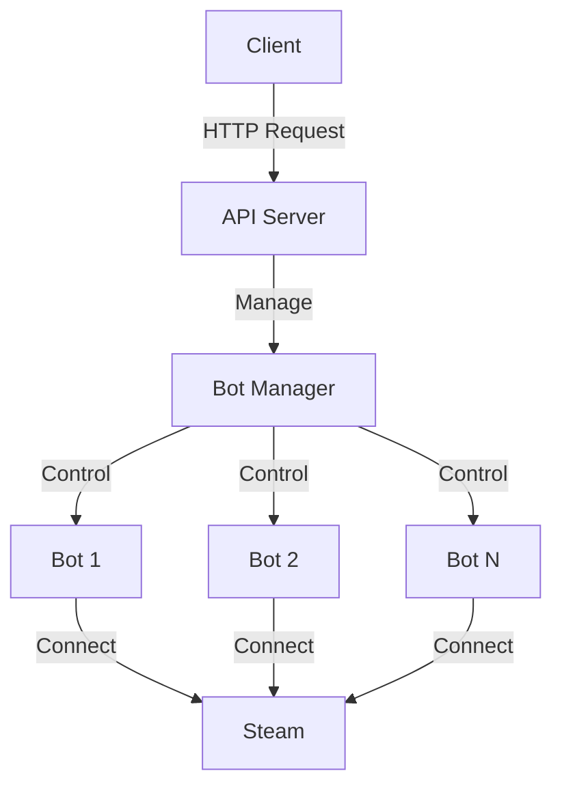

# API Overview

The Dota Lobby Manager provides a simple API for managing Dota 2 lobbies and bots.

## Base URL

```
http://localhost:8080
```

Replace `localhost` with your server address in production.

## Architecture

The API follows a RESTful design pattern:



## Authentication

Currently, the API does not require authentication. It's recommended to:

- Run behind a reverse proxy with authentication
- Use firewall rules to restrict access
- Deploy in a private network

!!! warning "Production Security"
    In production, always add authentication and authorization before exposing the API.

## Response Format

All API responses are in JSON format:

### Success Response

```json
{
  "success": true,
  "data": {
    // Response data
  }
}
```

### Error Response

```json
{
  "success": false,
  "error": {
    "code": "ERROR_CODE",
    "message": "Human readable error message"
  }
}
```

## HTTP Status Codes

| Status Code | Description |
|------------|-------------|
| 200 | Success |
| 201 | Created |
| 400 | Bad Request |
| 404 | Not Found |
| 500 | Internal Server Error |
| 503 | Service Unavailable |

## Rate Limiting

Currently, no rate limiting is implemented. Consider adding:

- Rate limiting middleware
- Request throttling
- IP-based limits

## Endpoints

### Bot Management

| Method | Endpoint | Description |
|--------|----------|-------------|
| GET | `/api/bots` | List all bots |
| GET | `/api/bots/{name}` | Get bot details |
| POST | `/api/bots/{name}/enable` | Enable a bot |
| POST | `/api/bots/{name}/disable` | Disable a bot |

### Lobby Management

| Method | Endpoint | Description |
|--------|----------|-------------|
| POST | `/api/lobbies` | Create a lobby |
| GET | `/api/lobbies` | List active lobbies |
| GET | `/api/lobbies/{id}` | Get lobby details |
| DELETE | `/api/lobbies/{id}` | Close a lobby |

### Health Check

| Method | Endpoint | Description |
|--------|----------|-------------|
| GET | `/health` | Health check |
| GET | `/ready` | Readiness check |

## Example Requests

### List Bots

```bash
curl http://localhost:8080/api/bots
```

Response:
```json
{
  "success": true,
  "data": {
    "bots": [
      {
        "name": "bot1",
        "username": "steam_user1",
        "enabled": true,
        "status": "connected"
      },
      {
        "name": "bot2",
        "username": "steam_user2",
        "enabled": false,
        "status": "disconnected"
      }
    ]
  }
}
```

### Health Check

```bash
curl http://localhost:8080/health
```

Response:
```json
{
  "success": true,
  "data": {
    "status": "healthy",
    "timestamp": "2026-01-08T14:00:00Z",
    "uptime": 3600
  }
}
```

## Versioning

The API currently does not use versioning. Future versions may include:

```
http://localhost:8080/api/v1/bots
http://localhost:8080/api/v2/bots
```

## CORS

CORS (Cross-Origin Resource Sharing) is not currently configured. To enable CORS for web applications:

1. Add CORS middleware
2. Configure allowed origins
3. Set appropriate headers

## WebSocket Support

WebSocket support for real-time updates is planned for future releases:

```javascript
// Future WebSocket API
const ws = new WebSocket('ws://localhost:8080/ws');
ws.onmessage = (event) => {
  const update = JSON.parse(event.data);
  console.log('Lobby update:', update);
};
```

## Error Codes

| Code | Description |
|------|-------------|
| `INVALID_REQUEST` | Request format is invalid |
| `BOT_NOT_FOUND` | Bot with specified name not found |
| `LOBBY_NOT_FOUND` | Lobby with specified ID not found |
| `BOT_OFFLINE` | Bot is not connected |
| `INTERNAL_ERROR` | Internal server error |

## Best Practices

### Request Headers

Always set appropriate content type:

```bash
curl -H "Content-Type: application/json" \
     -X POST \
     -d '{"name":"lobby1"}' \
     http://localhost:8080/api/lobbies
```

### Error Handling

Always check the `success` field:

```javascript
fetch('http://localhost:8080/api/bots')
  .then(res => res.json())
  .then(data => {
    if (data.success) {
      console.log('Bots:', data.data.bots);
    } else {
      console.error('Error:', data.error.message);
    }
  });
```

### Retries

Implement exponential backoff for retries:

```python
import time
import requests

def make_request_with_retry(url, max_retries=3):
    for attempt in range(max_retries):
        try:
            response = requests.get(url)
            if response.status_code == 200:
                return response.json()
        except requests.RequestException as e:
            if attempt == max_retries - 1:
                raise
            time.sleep(2 ** attempt)  # Exponential backoff
```

## See Also

- [API Examples](examples.md) - Practical examples
- [Configuration](../configuration/bot-setup.md) - Bot setup
- [Docker Deployment](../deployment/docker.md) - Deploy API
