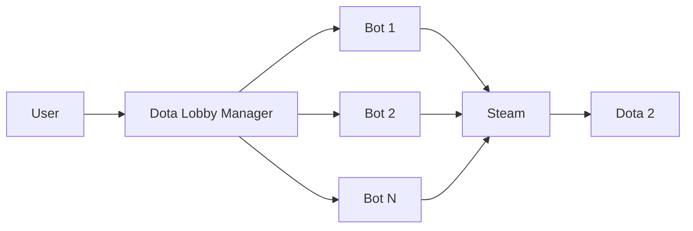

# Dota Lobby Manager

Welcome to the Dota Lobby Manager documentation! This service helps you create and manage Dota 2 lobbies automatically using Steam bot accounts.

## Features

- **Bot Management**: Configure and manage multiple Steam bot accounts
- **Viper Configuration**: Secure configuration management using Viper
- **Docker Support**: Easy deployment with Docker and Docker Compose
- **Environment Variables**: Flexible configuration through environment variables
- **Multi-stage Builds**: Optimized Docker images for production

## Quick Links

- [Installation Guide](getting-started/installation.md) - Get started with dota_lobby
- [Quick Start](getting-started/quick-start.md) - Run your first lobby
- [Docker Deployment](deployment/docker.md) - Deploy with Docker
- [API Examples](api/examples.md) - API usage examples

## Architecture

The Dota Lobby Manager is built with Go and uses:

- **Viper** for configuration management
- **Docker** for containerization
- **GitHub Actions** for CI/CD

## Getting Help

- Check our [GitHub Issues](https://github.com/kettleofketchup/dota_lobby/issues)
- Read the [API Documentation](api/overview.md)
- Review [Configuration Guide](configuration/bot-setup.md)
